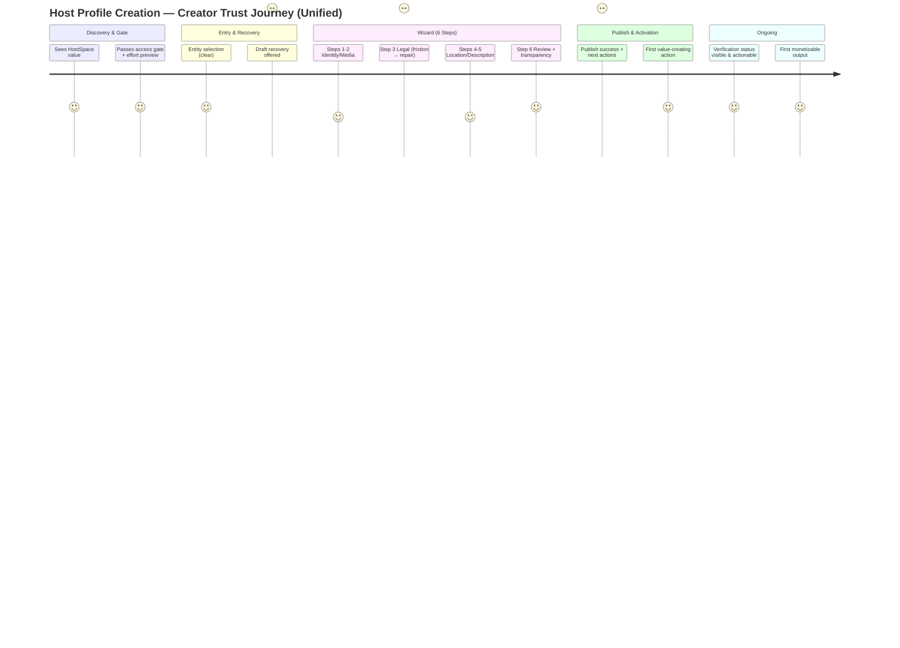

# Creator Trust Journey Maps — Host Profile Creation

**Purpose**: Detailed before/after journey analysis from the Creator Livelihood Trust perspective. Used to drive unification decisions, component priorities, and success measurement.

**Personas**:
- Maya — Venue Owner (high legal/compliance stakes, monetization critical)
- Aisha — Community Organizer (emotional + social stakes, first-time formal creator)

---

## Journey A: Maya — Venue Owner (120-seat cultural space, Melbourne)

**Goal**: Publish venue profile so she can sell tickets and list on CultureMarket.

### Current State (Dual System) — Trust Score: 4.1 / 10

| Stage                        | Experience                                                                 | Trust Impact                                      | Erosion Points                                                                 |
|-----------------------------|----------------------------------------------------------------------------|---------------------------------------------------|--------------------------------------------------------------------------------|
| HostSpace Entry             | Access gate explains "24h + possible extra verification"                   | Mild positive                                     | Good framing but no preview of effort required                                 |
| Category Selection          | Chooses "Venue" in rich Creation Lab workspace                             | Confusion                                         | "Is this the serious version or the quick one?"                                |
| Form Experience             | Lightweight Hostspace* form — basic fields, no structured legal flow       | Over-optimism → later shock                       | Feels too easy. No ABN/licence depth                                           |
| Legal & Compliance          | Skipped or minimal fields                                                  | Severe later anxiety                              | Discovers paid events blocked only after publish                               |
| Draft / Recovery            | Weak or absent                                                             | High risk of loss                                 | 2 hours of work on photos + description can vanish                             |
| Publish                     | Profile appears but monetization disabled with poor explanation            | "I was misled"                                    | Trust heavily damaged                                                          |
| Post-Publish                | No clear activation path or verification status                            | Wandering + frustration                           | "Why did I bother?"                                                            |

**Cumulative Effect**: Maya feels the platform did not respect the seriousness of her business. High chance of churn or negative word-of-mouth in venue/organiser communities.

### Target Unified State (FormWizard Path) — Trust Score: 9.2 / 10

| Stage                        | Experience                                                                 | Trust Impact                                      | Repair / Elevation Mechanisms                                                  |
|-----------------------------|----------------------------------------------------------------------------|---------------------------------------------------|--------------------------------------------------------------------------------|
| Entry                       | "Venue Profile — Guided 6-step process (15–30 min). Legal & verification explained upfront" | Calm confidence                                   | Transparent effort + benefit framing                                           |
| Draft Recovery (if any)     | Prominent, beautiful modal with progress %, step label, entity icon        | Major relief + "they have my back"                | useDraftRecovery + elevated DraftRecoveryModal                                 |
| Step 1–2 (Identity + Media) | Smooth, culturally warm, AI assist available                               | Building momentum                                 | Good existing foundation                                                       |
| Step 3 (Legal — Critical)   | Conditional ABN (real-time gov lookup), tax, multi-licence upload with expiry + clear "Why this unlocks paid ticketing" | High friction turned into **trust peak**         | VerificationStatusBanner + excellent entity-specific copy in Step3Legal        |
| Step 4–5                    | Location + rich description (culturally respectful tone)                   | Continued competence                              | —                                                                              |
| Step 6 (Review)             | Explicit checklist: "Live for directory + free events immediately. Paid + CultureMarket after verification (usually 1–3 days)" | Full transparency                                 | Strong "what happens next" + VerificationStatusBanner                          |
| Publish Success             | Celebration + 3 prominent one-tap actions: Create event, Add more photos, Request verification boost | "This platform gets me"                           | Post-publish activation surface (new requirement)                              |
| Day 1–3                     | Clear verification status in HostSpace dashboard + profile card            | Sustained trust                                   | Reusable VerificationStatusBanner component                                    |

**Key Trust Repair Moments**:
- Draft recovery on phone between venue load-in and dinner.
- Successful real-time ABN lookup with immediate "This unlocks X" message.
- Post-publish screen that respects her as a serious operator.

---

## Journey B: Aisha — First-Time Community Organizer (Diaspora women’s cultural collective)

**Goal**: Create a safe, visible home for her community and start hosting events.

### Current State — Trust Score: 5.8 / 10

- Lower legal friction than Maya, but high emotional stakes.
- Lighter forms feel "quick" but leave her unsure if the profile is "real" enough.
- Weak draft recovery risks losing the careful wording she wrote for her community guidelines.
- Post-publish experience is flat — no immediate sense of momentum or belonging.

### Target Unified State — Trust Score: 9.0 / 10

- Entry feels welcoming and professional ("Launch your community with the right foundations").
- Draft recovery is emotionally powerful: "We kept the description you were working on last night."
- Step 5 (Description) uses AI assist with culturally sensitive prompts ("Help me sound warm but clear about our values").
- Step 6 + post-publish explicitly surfaces "Invite your first 5 core members" and "Create your first gathering".
- Verification is light or optional for pure community, but still transparently explained.

**Critical Emotional Trust Moments**:
- Seeing her community name and photo preview in the review step.
- First member invitation succeeding immediately after publish.
- Feeling that the platform treated her collective with the same seriousness as a venue or business.

---

## Cross-Persona Trust Erosion Hotspots (Current Dual System)

1. **Silent Monetization Gates** — Biggest single destroyer of trust (especially for Venue/Business/Organiser).
2. **Draft Loss** — Universal pain, disproportionately damages creators working in short bursts on mobile.
3. **Verification Opacity** — "Pending" with no "what I can do today vs tomorrow".
4. **Inconsistent Mental Models** — "Why did my friend’s community creation feel completely different from mine?"

## Unified Flow Trust Elevation Levers (Prioritized)

1. **DraftRecoveryModal elevation** (highest emotional ROI)
2. **VerificationStatusBanner** (reusable, appears in wizard + post-publish + dashboard)
3. **Step 3 Legal as trust peak** (already strong in wizard — must be the *only* path)
4. **Post-publish activation surface** (turns publish from "done" into "now we begin")
5. **Consistent entry language** across EntityTypeSelector and HostspaceCreateWorkspace

---

## Mermaid Overview — Unified Creator Journey (Trust Lens)

---

**Usage**: Every major change to the creation flow must be evaluated against these maps. Update this document when new trust signals or erosion points are discovered in production.

*Companion to the Creator Trust Playbook.*
