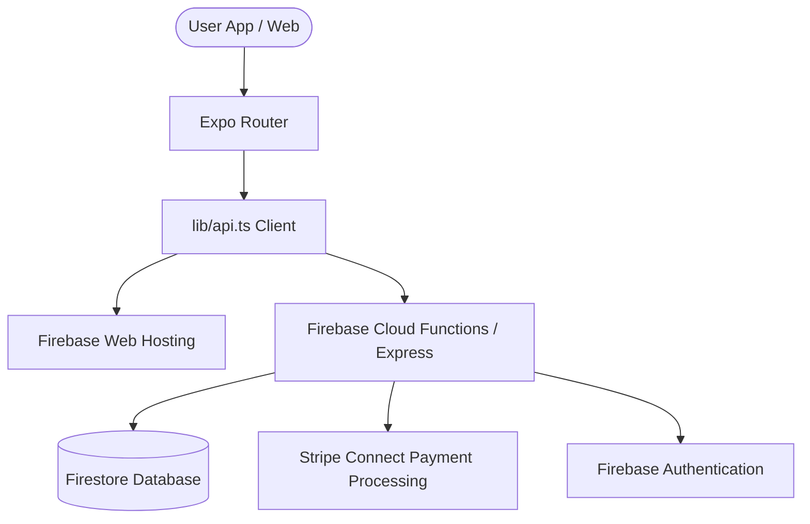

# CulturePass: Strategic Appraisal, Government Submission & Investment Prospectus

Welcome to the master business and technical strategic report for **CulturePass**. This document compiles our comprehensive platform overview, a formal proposal for local government partnerships, a slide-based investor pitch deck, and a targeted go-to-market strategy.

---

## Section 1: Executive & Technical Product Report

### 1.1 Product Vision: "Belong Anywhere"
CulturePass is a premier B2B2C cultural lifestyle marketplace built for diaspora communities globally. The platform solves the fragmented nature of cultural discoveries by housing events, businesses, venues, communities, and exclusive member perks in a single, high-fidelity experience.



### 1.2 Core Product Surfaces
* **Event Discovery Rail**: Dynamic curation by city, category, culture-tag, and countdown schedules.
* **Community Hubs**: Digitized spaces for cultural diaspora groups and heritage associations.
* **CultureMarket**: A B2B2C directory for specialty businesses (dining, groceries, fashion, services).
* **CultureWheel**: A gamified exploration engine that matches users with local activities, events, and venues.
* **Indigenous Spotlight**: A dedicated area celebrating First Nations culture and acknowledging traditional owners (using geolocation nearest-LGA mapping).
* **HostSpace Creator Suite**: A robust creator portal where organizers can spin up events, manage ticketing, configure Stripe splits, and access analytics.

### 1.3 Tech Stack & Design Architecture

| Layer | System | Details |
| :--- | :--- | :--- |
| **Cross-Platform Client** | React Native & Expo | Single codebase targeting iOS, Android, and Responsive Web. |
| **Design Language** | Luxe Heritage | A design system built on atomic tokens, utilizing custom glass overlays (`GlassView`) and curated palettes. |
| **Backend & Hosting** | Firebase | Cloud Functions (Express / Node.js 22), Firestore DB, and Firebase Hosting. |
| **Ticketing & Pay** | Stripe Connect | Dynamic ticketing checkouts, automated platform fee splits (10% standard), and host payouts. |
| **Identity System** | Firebase Auth | Email verification, Google Sign-In, Apple Sign-In, and biometric lock hooks. |

---

## Section 2: Submission to Local Government

> [!IMPORTANT]
> **Executive Summary for Government Evaluation**
> CulturePass serves as a digital infrastructure for civic councils (Local Government Areas - LGAs). It promotes social cohesion, eases settlement paths for multicultural residents, and accelerates local economic growth by bridging cultural groups with councils and native businesses.

### 2.1 Promoting Social Cohesion & Integration
Relocating to a new country or city can be isolating. CulturePass solves this by auto-scoping the user's nearest council area via GPS to surface local community groups, heritage associations, and language clubs. This accelerates social integration and builds community networks immediately.

### 2.2 Supporting Multicultural Businesses (LGA Directory)
Local cultural merchants, grocers, and specialty service providers represent the economic backbone of diverse suburbs. 
* Councils can leverage CulturePass to publish and promote local business registries.
* Advanced LGA proximity filters showcase businesses to nearby users.
* High-frequency events (workshops, community festivals, markets) drive foot traffic directly to brick-and-mortar storefronts.

### 2.3 The First Nations Integration
In alignment with reconciliation and cultural respect, CulturePass features a permanent **Indigenous Spotlight** rail. The app automatically recognizes the traditional Aboriginal lands of the user’s current LGA and surfaces First Nations-owned organizations, festivals, and educational initiatives.

---

## Section 3: Investor Pitch Deck (Slideshow)

Use the carousel control below to swipe through the slides of our seed-round investment pitch:

````carousel
# Slide 1: The Opportunity
## CulturePass: Belong Anywhere
### Seed Round Prospectus

* **The Vision**: The definitive digital passport for multicultural diaspora communities.
* **The Goal**: Connecting a $1.2T global diaspora demographic with local events, merchants, and groups.
* **Distribution**: Live since April 2026 on iOS, Android, and Web.

<!-- slide -->

# Slide 2: The Problem
## Fragmented Curation & Digital Isolation

* **For Users**: Sourcing ethnic groceries, diaspora associations, and cultural festivals is scattered across old Facebook groups, WhatsApp threads, and directory blogs.
* **For Merchants**: Small cultural businesses lack the marketing reach or modern ticketing tools to engage younger, mobile-first audiences.
* **For Communities**: Traditional cultural associations struggle to digitize and maintain membership.

<!-- slide -->

# Slide 3: The Solution
## A Unified B2B2C Cultural Ecosystem

* **Unified Directory**: Events, communities, dining, shopping, and perks housed under a premium, cohesive app.
* **HostSpace**: Self-service publishing suite enabling organizers to run ticket checkouts in under 3 minutes.
* **CultureWheel**: Gamified discovery loops that incentivize users to break out of routine and explore local culture.
* **First-Class Native Experience**: Fluid animations, dark modes, offline-ready ticket wallet, and secure authentication.

<!-- slide -->

# Slide 4: Business Model & Monetization
## Scale-Ready Revenue Streams

* **Marketplace Commissions**: 10% platform fee splits via Stripe Connect on event ticketing and CultureMarket checkouts.
* **Host SaaS Subscriptions**: Premium analytical dashboards, SMS/FCM attendee broadcasting, and recurring event drafts.
* **Consumer Memberships**: Tiered monthly perks (Plus/Elite/VIP) providing exclusive brand deals, ticket priority, and cashback rewards.

<!-- slide -->

# Slide 5: Technical Advantage
## Built to Scale Safely

* **Agile Monorepo**: Expo-driven React Native app paired with Firebase Serverless Functions ensures low maintenance and rapid deployments.
* **Design System Moat**: The Luxe design language enforces cohesive typography and colors across all viewports.
* **Security at Core**: Native biometric sign-ins, mandatory email verification safeguards, and automated API error handling.
* **Offline-Ready Ticketing**: QR code storage allowing seamless check-in scans without mobile reception.

<!-- slide -->

# Slide 6: Roadmap & Milestones
## Looking Ahead: Q3–Q4 2026

* **Promo Engine**: Advanced coupon codes and loyalty discount systems.
* **Organizer Analytics**: Rich visualization dashboards for hosts.
* **Push Curation**: Geo-fenced push notifications matching taste tags.
* **Global Expansion**: Expanding target cities across the UK, CA, UAE, and NZ.
* **Target metrics**: Projecting 150k monthly active users by year-end.
````

---

## Section 4: Marketing & Growth Strategy

To establish market dominance, CulturePass deploys a dual-sided marketing playbook that targets both host organizers and end-users:

### 4.1 Host Acquisition (Supply-Side)
1. **Direct Organizer Outreach**: Onboard community hosts, diaspora student associations, and festival committees by offering a 0% platform fee for their first three months.
2. **Specialty Merchant Onboarding**: Partner with cultural dining venues, specialized grocers, and fashion designers to list their exclusive perks on the platform, driving them free traffic in exchange for members-only deals.
3. **Council Alliances**: Collaborate with city councils to digitize their local events list and direct cultural directories into the app.

### 4.2 User Acquisition (Demand-Side)
1. **Micro-Community Influencer Campaigns**: Partner with cultural creators (vloggers, student leaders, expats) to share their favorite local "discoveries" using CulturePass.
2. **Interactive QR Signage**: Place physical, high-aesthetic QR code boards at major cultural hubs, grocers, and festivals leading directly to the app.
3. **The CultureWheel Loop**: Promote the "CultureWheel Challenge" on social media — encouraging users to spin the wheel and record themselves attending the suggested cultural vibe of the day.

### 4.3 Retention Mechanisms
* **Loyalty Points System**: Reward active users with points for ticket checkouts, redeemable for discounts at local cultural restaurants.
* **Community Notifications**: Automatic alerts for new events created by joined diaspora communities.
* **Membership Lock-in**: High-value local dining perks that offset the cost of membership in their first transaction.
